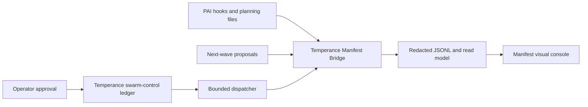

<div align="center">


# Manifest Skill Cluster

**A live, project-scoped visual projection of planning, execution, operations, delivery, and evidence.**

</div>

Manifest makes agent work inspectable while it is happening. It does not replace the runtime that owns that work: Temperance Engine, PAI hooks, planning artifacts, and OmniRoute remain the sources of truth.

## What is live now

The `visual-pcb` package is a five-page local operator console:

- **Overview** — topology, phase rail, attention, current events, and selected evidence.
- **Planning** — projects, materialized next-wave options, planning sessions, and approval observations.
- **Execution** — observed agent lanes, session lifecycles, and routing telemetry.
- **Evidence** — bounded/redacted event records and their source pointers.
- **Ops / Delivery** — freshness, project readiness, source mix, alerts, and delivery proof.

It reads a local Manifest Bridge snapshot and Server-Sent Events stream. It shows `LIVE`, `STALE`, `OFFLINE`, and empty state deliberately; it never invents provider health, worker status, or completion.

## Authority model



- **Temperance Engine** owns task phases, proposal construction, routing policy, approval checks, and swarm safeguards.
- **Manifest Bridge** owns bounded event normalization, persistence, snapshots, and SSE.
- **This console** owns visual interpretation of those projections.
- A console click, JSONL record, or SSE event can never authorize a worker.

The automatic paid-swarm path is still deliberately gated. It requires a PostgreSQL one-use claim plus fresh project, Git, source, task, policy, quota, worktree, and concurrency checks. Worker receipts, terminal closure, lifecycle projections, and UI eligibility detail are still tracked as open release gates.

## Run the local operator view

Clone this repository alongside [Temperance Engine](https://github.com/Sheshiyer/temperance_engine), then start the bridge before the client:

```bash
export TEMPERANCE_ROOT=/path/to/temperance_engine
export MANIFEST_ROOT=/path/to/manifest-skill-137

cd "$TEMPERANCE_ROOT/package/manifest-bridge"
bun install
bun run src/cli.ts serve --all --port 8766

# In a second terminal:
cd "$MANIFEST_ROOT/visual-pcb"
npm install
VITE_MANIFEST_BRIDGE_URL=http://127.0.0.1:8766 npm run dev -- --host 127.0.0.1
```

Initialize and sync a project before expecting live rows in the console:

```bash
cd "$TEMPERANCE_ROOT"
node package/router/temperance-project-init.mjs --cwd /path/to/project
cd package/manifest-bridge
bun run src/cli.ts sync --cwd /path/to/project
```

The client is normally available at `http://127.0.0.1:5173`; the bridge is normally available at `http://127.0.0.1:8766`.

## Documentation map

- [visual-pcb/README.md](visual-pcb/README.md) — visual pages, API reads, design language, and client checks.
- [docs/temperance-integration.md](docs/temperance-integration.md) — cross-repository setup, data flow, authority boundaries, and safety status.
- [CONSOLE_GAP_REGISTER.md](CONSOLE_GAP_REGISTER.md) — maintained 48-item evidence-oriented console backlog.
- [manifest/README.md](manifest/README.md) — archival static HTML artifacts; not the live runtime console.
- [SKILL.md](SKILL.md) — skill-cluster behavior and source boundaries.

## Legacy static outputs

`manifest/` retains self-contained HTML artifacts for sharing or archival review. Those documents do not subscribe to runtime telemetry and must not be read as current operational truth. The bridge-backed `visual-pcb` console is the live surface.

## Verification

```bash
cd visual-pcb
npm run build
npm run lint
```

## Assets

The hero and icon assets preserve the original LCARS / Living Blueprint visual language. The current console uses that language as an operational interface—dark instrument panels, Swiss grid, cyan flow, orange attention, magenta decisions, violet routing, and mint healthy evidence—rather than a simulated system diagram.
