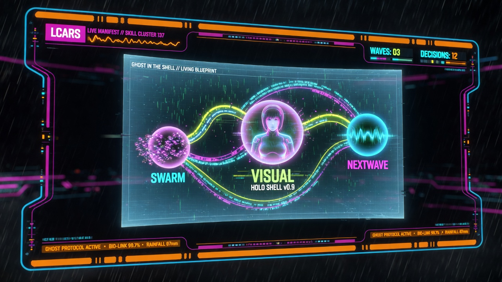

<div align="center">



# Manifest Skill Cluster

**The living visual manifest of the three-skill bundle.**

Every architecture decision, stub, wave, contract, and "done" is visualized and kept concurrent.

</div>

---

**The three skills it bundles:**

1. **swarm-architect-skill** — Broad multi-agent planner (phase → wave → swarm, contracts, GitHub sync, OpenViking memory, with optional GitHub Copilot autonomous dispatch routing for eligible tasks).
2. **github-next-wave-orchestrator** — Specialized GitHub-grounded engine: repo scan → status report → prioritized next wave with explicit human vs GitHub Copilot autonomous dispatch (one optional explicit lane) + label-based dispatch.
3. **visual layer** — The heart. Five static generators (architecture, timeline, flowchart, dashboard, technical docs) **plus the live interactive visual-pcb** (Ghost in the Shell futurist + Star Trek LCARS 3D R3F experience for true real-time "when the changes are happening" visualization).

## Core Principle

**The visual layer is not an afterthought — it is the single source of manifested truth.**

When you run the manifest:
- The planners produce structure (plans, waves, decisions, stubs, dispatch status, lane splits).
- The manifest wiring feeds those artifacts into the visual generators (static HTML + live 3D).
- You get a living set of visuals served locally.
- A watcher (or manual refresh) keeps everything concurrent as the underlying work changes.

## The Live Visual Experience (visual-pcb)

The custom **visual-pcb** (in this repo under `visual-pcb/`) is the "truly visual and adaptive" implementation:

- Ghost in the Shell cyberpunk holographic + digital rain + data streams.
- Star Trek LCARS dashboard framing (black console, rounded orange/cyan/magenta/yellow/purple panels, uppercase technical monospace, high-contrast status LEDs and bars).
- Living Blueprint base (Swiss-grid precision + bioluminescent energy flows from the Design vault).
- Three nodes (SWARM / NEXTWAVE / central VISUAL as the emphasized living heart) with curved neon flows and traveling particles.
- Evidence beacons for every decision/stub/"done".
- Immediate reactivity: buttons ("+ Add Decision", "Dispatch Wave", "Manifest Update", Pause/Resume) cause new beacons, particle bursts, core pulses, and count updates in the 3D hologram.

Run it:

```bash
cd visual-pcb
npm install
npm run dev
# Open the local Vite URL (usually http://localhost:5173 or 5174)
```

Orbit with mouse, click nodes/beacons for LCARS-style detail panels, watch the live state changes.

## Static Visual Outputs (manifest/)

Generated self-contained single-file HTML (using the visual-documentation-skills generators + cluster context):

- `manifest/index.html` — The living hub
- `manifest/cluster-architecture.html`
- `manifest/cluster-timeline.html`
- `manifest/cluster-flow.html`
- `manifest/cluster-dashboard.html`

Serve them:

```bash
cd manifest
python3 -m http.server 8765
# Open http://127.0.0.1:8765/
```

## How to Use the Cluster

1. Ensure the three skills are available in your runtime.
2. (Optional but recommended) Run the planners (swarm + next-wave) to produce fresh plans, waves, decisions, stubs, and dispatch evidence.
3. Generate/refresh the visuals (prompts in `manifest/README.md` or the cluster orchestrator).
4. Serve the static manifest or the live visual-pcb.
5. (Future) Add a watcher that monitors planner outputs and auto-regenerates the affected visuals.

See `SKILL.md` for the full skill definition and output contract.

## Assets

Custom icons and hero generated in the exact blended aesthetic (Ghost in the Shell + LCARS + Living Blueprint from the Design vault, using nano_banana_2 via Higgsfield):

- `assets/manifest-hero-banner.jpg` — Wide README / social hero (LCARS console framing the live 3D holo)
- `assets/icons/manifest-cluster-logo.jpg` — Primary square logo/icon
- `assets/icons/visual-favicon.jpg` — Favicon / small icon for the live demo
- `assets/icons/three-skills-set.jpg` — Matching icon set for SWARM / VISUAL / NEXTWAVE

These were created following the Art / image generation process with prompts derived from the Design resources (Amir premium editorial product/icon style, Curios "Living Blueprint" Swiss-grid + bioluminescent, Nakul color combos, logo generators) and the locked GitS + LCARS taste established for the visual-pcb.

## Why This Cluster Exists

High-ceremony planning and GitHub-grounded execution produce a lot of invisible structure. This cluster makes every decision, stub, wave, dispatch lane, and "done" **visible, reviewable, and alive** — in both portable static HTML and a real-time interactive 3D holographic console.

It is the single pane of glass for the work.

## Contributing & License

See the source skills for contributing details. This cluster is the coordinating layer and visual heart.

**Built with the three skills + the Design vault taste (Amir, Curios, Nakul) + the live visual-pcb (GitS + LCARS).**

---

<div align="center">


The invisible, made visible. And kept alive.

</div>
