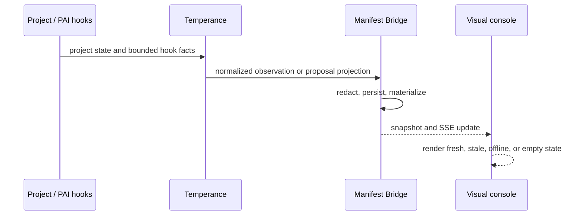

# Manifest × Temperance Integration

## Purpose

Manifest is the visual read surface for Temperance-governed work. It helps an operator see what is being planned, observed, approved, executed, verified, and delivered without turning the UI into a second orchestration authority.

## Repository responsibilities

| Repository | Runtime responsibility | Source of truth |
|---|---|---|
| [`temperance_engine`](https://github.com/Sheshiyer/temperance_engine) | PAI phase flow, project initialization, next-wave proposals, routing, event bridge, and swarm safety controls | project files, hooks, policy, PostgreSQL control ledger when enabled |
| `manifest-skill-137` | visual console, static sharing artifacts, information hierarchy, and evidence inspection | bridge snapshot and named SSE events |

## Runtime flow



The bridge normalizes only bounded payloads. Raw prompts, raw tool bodies, credentials, and provider secrets are outside the UI contract.

## Algorithm activation boundary

The console is not activated by every prompt. The PAI classifier first resolves
the mode; only `ALGORITHM` runs inside the host allowlist emit
`algorithm.activated`. The event is anchored to the real Git worktree root and
carries a session-scoped `run_id`, mode, tier, phase, and enrollment state.

An eligible repository without `.temperance/manifest.json` is shown as
**observed-only**. That is a useful visual candidate, not implicit enrollment:
the hook never writes to the repository. Later agent events must present the
same active-run receipt, so Native work and unrelated projects do not become
phantom activity in the console.

## Project bootstrap

```bash
export TEMPERANCE_ROOT=/path/to/temperance_engine
cd "$TEMPERANCE_ROOT"
node package/router/temperance-project-init.mjs --cwd /path/to/project

cd package/manifest-bridge
bun run src/cli.ts init --cwd /path/to/project
bun run src/cli.ts sync --cwd /path/to/project
bun run src/cli.ts serve --all --port 8766
```

Then start this repository’s `visual-pcb` client with
`VITE_MANIFEST_BRIDGE_URL=http://127.0.0.1:8766`.

## Safety model

The visual console can present an approval observation but cannot approve a plan, consume an approval, claim a dispatch, or start a worker. Those actions belong to Temperance’s control path.

Automatic swarm launch is **off by default**. It is an opt-in pilot requiring a frozen request, PostgreSQL-backed one-use claim, drift/quota/worktree checks, and explicit environment gates. See Temperance’s [control-plane guide](https://github.com/Sheshiyer/temperance_engine/blob/main/docs/manifest-control-plane.md) and [swarm runbook](https://github.com/Sheshiyer/temperance_engine/blob/main/docs/SWARM-CONTROL-RUNBOOK.md).

Open release gates remain visible in this repository’s [console gap register](../CONSOLE_GAP_REGISTER.md) and Temperance’s orchestration gap register. Treat absent telemetry as absent—not as healthy or complete.
